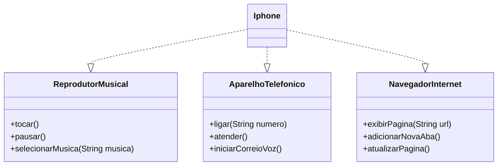

# Desafio POO - Simulação do iPhone (DIO + Santander)

Este projeto representa a modelagem orientada a objetos de um componente **iPhone**, simulando suas funcionalidades como **Reprodutor Musical**, **Aparelho Telefônico** e **Navegador de Internet**, conforme apresentado no lançamento original do iPhone em 2007.

---

## Resumo Técnico

- Linguagem: **Java 21+**
- Paradigma: **Programação Orientada a Objetos (POO)**
- Componentes:
    - **3 interfaces**:
        - `ReprodutorMusical`
        - `AparelhoTelefonico`
        - `NavegadorInternet`
    - **1 classe concreta**:
        - `Iphone`, que implementa todas as funcionalidades
- Teste via `Main.java` (execução em console)
- Código limpo e organizado por pacotes

---

## Funcionalidades

### Reprodutor Musical
- `tocar()`
- `pausar()`
- `selecionarMusica(String musica)`

### Aparelho Telefônico
- `ligar(String numero)`
- `atender()`
- `iniciarCorreioVoz()`

### Navegador Internet
- `exibirPagina(String url)`
- `adicionarNovaAba()`
- `atualizarPagina()`

---

## Diagrama UML (Mermaid)

---

## Minha Experiência com o Projeto

Este desafio foi importante para consolidar meu entendimento de **POO com Java**. Trabalhei com:

- **Interfaces** para abstração de responsabilidades específicas (reprodutor musical, telefone e navegador).
- **Implementação concreta** na classe `Iphone`, com uso correto do `@Override`.
- Organização do projeto em **pacotes separados** (`interfaces`, `modelo`, `Main`) seguindo princípios de **código limpo**.
- Criação de um `Main.java` para testar os métodos simulando a usabilidade no console.

Apesar de ser um projeto tranquilo, me concentrei na clareza, coesão e boas práticas, visando um código legível, reaproveitável e fácil de manter. A estrutura por interfaces reforçou a ideia de separação de responsabilidades e polimorfismo.

Esse exercício também ajudou a reforçar meu conhecimento em UML e a praticar modelagem com Mermaid para representar a arquitetura do sistema.

---
